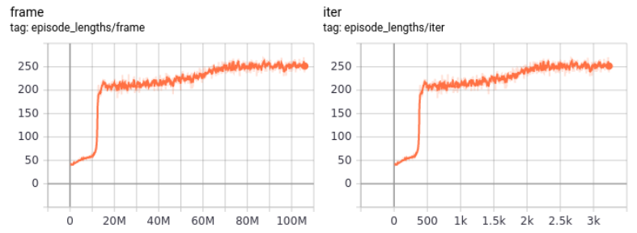
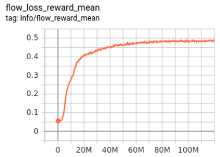
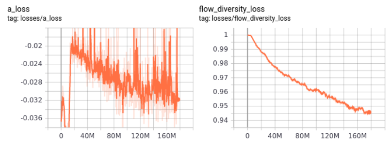
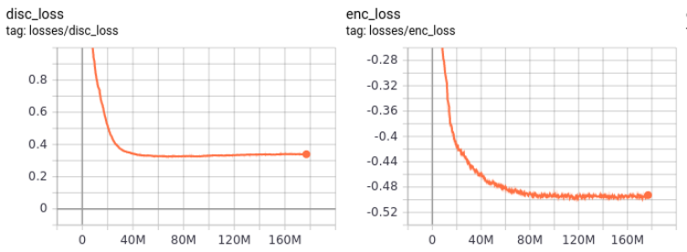

# Design Space of Skill Embeddings for Physically Simulated Characters

> Exploring flow-based distribution matching as an alternative to GAN objectives in adversarial imitation learning for reusable motor skill acquisition.

**Manas Tiwari · Akash Mishra · Arinjay Saraf · Yuvraj Singh**
Institute of Engineering & Technology, DAVV, Indore · B.E. Computer Engineering · 2022–23

---

## Overview

Control policies in physics-based character animation are typically trained from scratch for every task — a process that is both compute-intensive and brittle. This project builds on NVIDIA's [ASE framework](https://arxiv.org/abs/2205.01906) (Peng et al., 2022), which uses adversarial imitation learning to learn reusable skill embeddings from large, unstructured motion datasets.

Our contribution is a **systematic exploration of the design space** for the distribution matching objective at the heart of skill embedding pre-training. Specifically, we replace the GAN-based adversarial objective with **normalizing flow models** and evaluate the tradeoffs in generalizability, training stability, and downstream task performance.

The central question we investigate:

> *Can flow-based distribution matching learn more generalizable skill embeddings than GAN-based objectives, and at what cost?*

<p align="center">
  
  <br>
  <em>Flow model pre-training: humanoid acquiring reusable motion skills from unlabelled motion data in Isaac Gym</em>
</p>

---

## Key Finding

Flow models trained to the **same reward score as GAN-based ASE generalize better across downstream tasks** — producing more consistent behavior when transferred to tasks the model was not explicitly trained for.

The tradeoff is compute: GAN-based ASE converged in ~96 hours on an NVIDIA A100. Flow models required an estimated **~128 hours** to reach equivalent reward scores. Due to compute constraints, flow models were evaluated at intermediate checkpoints rather than full convergence — making the generalizability result particularly notable, as it held even at lower absolute performance.

| | GAN-based ASE (baseline) | Flow Models (ours) |
|---|---|---|
| Training to convergence | ~96 hrs (A100) | ~128 hrs (A100, estimated) |
| Downstream task generalizability | Baseline | **Better** |
| Training stability | Mode collapse prone | More stable |
| Reward at equivalent checkpoint | Baseline | Comparable |

---

## Method

### Two-Stage Framework

Following ASE, training is split into two stages:

**Pre-training (Low-Level Policy)**
A skill-conditioned policy π(a|s, z) is trained to map latent skill vectors z to behaviors that resemble motions in the dataset. Rather than using a GAN discriminator as the imitation objective, we use a **normalizing flow** to model the motion distribution directly, enabling exact log-likelihood computation.

This avoids the instability of adversarial training and sidesteps mode collapse — a known failure mode of GAN-based skill learning on diverse datasets.

**Task-Training (High-Level Policy)**
After pre-training, a high-level policy ω(z|s, g) is trained to select latent skill codes that direct the pre-trained low-level policy toward task-specific goals. No motion data is required at this stage.

### Dataset

The motion dataset was built from scratch in **Blender 3.1** — a custom humanoid rig with anatomically constrained joints was animated to produce motion clips ranging from locomotion primitives (walk cycle, balance recovery) to complex manipulation behaviors (pick-and-throw, sword combat). The pick-and-throw animations were hand-keyframed entirely by Yuvraj Singh, as no suitable reference data was publicly available.

Motion clips were exported as MJCF files and converted to `.npy` format for ingestion into the training pipeline.

---

## Results

Training was run in **Isaac Gym** (NVIDIA's massively parallel GPU simulator) using PPO with the RL-Games library. All experiments were logged with TensorBoard.

### Training Curves (Flow Model — Pre-training)

The plots below show the flow model pre-training run:

- **Episode length** converges steadily, indicating stable policy improvement
- **Flow reward mean** rises and plateaus, demonstrating successful skill acquisition
- **Diversity loss** decreases over training, confirming the skill discovery objective is working — the policy learns to produce distinct behaviors for distinct latent codes
- **Discriminator loss** stabilizes without the oscillation typical of GAN training


<p align="center">
  <b>Episode Length Convergence</b><br>
  
</p>

<p align="center">
  
  <br>
  <em>Left: Flow reward mean rises and plateaus — skill acquisition is stable. Right: Reward std remains bounded, no divergence.</em>
</p>

<p align="center">
  
  <br>
  <em>Left: Adversarial loss. Right: Diversity loss decreasing over training — the policy learns distinct behaviors for distinct latent codes.</em>
</p>

<p align="center">
  
  <br>
  <em>Left: Discriminator loss stabilizes without the oscillation typical of GAN training. Right: Encoder loss converges cleanly.</em>
</p>

### Downstream Tasks

The pre-trained low-level policy was transferred to the following tasks via high-level policy training:

- Heading (navigate to directional target)
- Location (reach a goal position)
- Reach (extend to a target point)
- Strike (deliver a hit to a moving target)
- Throw (pick up and throw an object)

Across all tasks, the flow-based low-level policy showed **more consistent transfer performance** compared to the GAN baseline at equivalent reward checkpoints, particularly on tasks requiring coordinated whole-body motion.

---

## Limitations

- Full convergence of flow models was not achieved due to compute budget constraints (~$X on cloud GPU). The generalizability advantage may widen or narrow at full convergence — an open question.
- Sim-to-real transfer was not attempted. Joint torque matching between simulation weights and physical hardware remains a significant open problem.
- The skill discovery objective still cannot fully capture the behavioral diversity in large, heterogeneous motion datasets — a limitation shared with the GAN baseline.
- Mode collapse in the GAN baseline was partially mitigated by an ensemble approach; this is documented in the dissertation.

---

## Hyperparameters

**Flow Model — Low-Level Policy**

| Parameter | Value |
|---|---|
| Latent Space Dimension dim(z) | 64 |
| Action Distribution Variance Σ_π | 0.0025 |
| Skill Discovery Weight β | 0.5 |
| Gradient Penalty Weight w_gp | 5 |
| Diversity Objective Weight w_div | 0.01 |
| Samples per Update | 131,072 |
| Minibatch Size (Policy/Value) | 4,096 |
| Minibatch Size (Encoder) | 1,024 |
| Discount γ | 0.99 |
| Adam Stepsize | 2×10⁻⁵ |
| PPO Clip Threshold | 0.25 |
| Episode Length T | 300 |

**High-Level Policy**

| Parameter | Value |
|---|---|
| Task Reward Weight w_G | 0.9 |
| Style Reward Weight w_S | 0.1 |
| Samples per Update | 131,072 |
| PPO Clip Threshold | 0.2 |

---

## Citation

If you build on this work:

```bibtex
@misc{tiwari2023flowskillembeddings,
  title     = {Design Space of Skill Embeddings for Physically Simulated Characters},
  author    = {Tiwari, Manas and Mishra, Akash and Saraf, Arinjay and Singh, Yuvraj},
  year      = {2023},
  note      = {Undergraduate Dissertation, IET DAVV, Indore},
  url       = {https://github.com/KingShark1/skill-embedding-design-space}
}
```

This work builds directly on:

> Peng, X.B., Guo, Y., Halper, L., Levine, S., & Fidler, S. (2022). ASE: Large-Scale Reusable Adversarial Skill Embeddings for Physically Simulated Characters. *ACM Trans. Graph.*, 41(4).

```bibtex
@article{
	2021-TOG-AMP,
	author = {Peng, Xue Bin and Ma, Ze and Abbeel, Pieter and Levine, Sergey and Kanazawa, Angjoo},
	title = {AMP: Adversarial Motion Priors for Stylized Physics-Based Character Control},
	journal = {ACM Trans. Graph.},
	issue_date = {August 2021},
	volume = {40},
	number = {4},
	month = jul,
	year = {2021},
	articleno = {1},
	numpages = {15},
	url = {http://doi.acm.org/10.1145/3450626.3459670},
	doi = {10.1145/3450626.3459670},
	publisher = {ACM},
	address = {New York, NY, USA},
	keywords = {motion control, physics-based character animation, reinforcement learning},
} 
```

---

## Contributing

Issues and pull requests are welcome, particularly around:
- Alternative distribution matching objectives (diffusion models, CPC — partially explored in the dissertation)
- Sim-to-real transfer experiments
- Extending the motion dataset

---

*Built with Isaac Gym · PyTorch · Blender · RL-Games*
